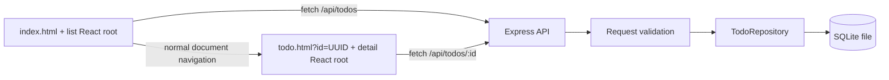

# Architecture

## Stack and layout

- React and TypeScript implement the two browser pages.
- Vite builds two independent HTML entries and shares reusable assets between them.
- Express 5 exposes JSON endpoints and serves the production build.
- Node.js `node:sqlite` stores tasks in a local SQLite database without a separate database service.
- Vitest and Supertest exercise repository behavior and the HTTP boundary.
- Playwright exercises the application in a real browser.

```text
client/                   React pages, shared UI, styles, and API client
  index.html              Todo list document
  todo.html               Individual todo document
server/                   Express app, validation, repository, database, seed script
shared/types.ts           Todo types and allowed priority/project values
tests/                    Automated tests
docs/                     Feature reference, API reference, architecture, REST requests
data/                     Runtime SQLite files; excluded from Git
dist/                     Compiled server and browser build; excluded from Git
```

## Request flow



The browser pages call a shared typed API client. The Express layer validates external input before the repository executes SQL. The repository maps database rows to the shared `Todo` shape. `createApp(db)` accepts an explicit database connection; importing the app does not start a server. Tests can use a fresh in-memory database for every case.

During development, Vite runs on port 5173 and forwards `/api` to port 3001. In production, Express serves `dist/client` and the API together. API requests therefore use relative URLs in both modes.

## Multiple-page design

Vite's `appType: 'mpa'` and two HTML build inputs make the list and detail page separate documents. React mounts independently in each document. Navigation uses standard links, and the detail entry obtains the identifier through `URLSearchParams`. No React Router is needed. A direct request for `todo.html?id=...` receives the actual detail document; an unrelated path does not fall back to the list page.

This follows [Vite's multiple-page guidance](https://vite.dev/guide/build#multi-page-app). Shared React components and CSS avoid duplicating the interface while preserving document navigation.

## Storage and boundaries

Each todo has a UUID primary key, title, description, completion state, priority, project, optional calendar due date, and creation/update/completion timestamps. Database columns use snake_case and API fields use camelCase. The schema is initialized when the database opens. Repository writes use SQL parameters so user text remains data.

The application uses a file database by default. `createDatabase()` defaults to `:memory:` for testing. Persistence tests explicitly close and reopen a temporary file database, then remove only their temporary directory.

SQLite's synchronous API keeps this small, single-user application straightforward. Large datasets, heavy write concurrency, and multiple server instances would call for a different storage/concurrency design. Dates have no time zone because they represent a calendar day; the UI compares them with the user's local calendar date. Metadata timestamps are UTC.

## Testing strategy

- Repository tests check observable ordering, missing-record behavior, and durable file storage.
- API tests cover the CRUD lifecycle, defaults, validation, field preservation, completion transitions, filtering, error envelopes, SQL-like input, and database isolation.
- Browser tests validate user flows and actual navigation between the list and detail documents.
- TypeScript checks client, server, shared contracts, and test code before the production build.
- CI runs `npm run check` and the Chromium browser tests on Node 24.

## Deliberate scope

The app is a single-user task manager with no authentication. Its API is intended for the local app; public deployment would need an access-control design. Project names are a small fixed set. There are no background reminders, attachments, recurring tasks, external integrations, or schema migration framework. The UI's task list is loaded in memory and the API has no pagination.

See [Node.js's SQLite documentation](https://nodejs.org/api/sqlite.html) for the database runtime API.
